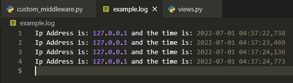
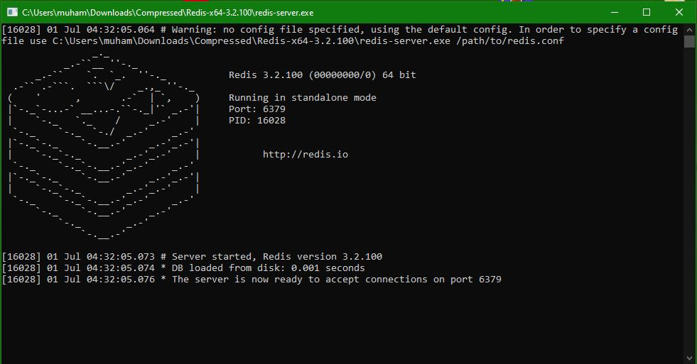

# Linked_Matrix_Task

## First task
I have implemented the logging module of python to get the IP and Time of user who sends request to our app,
it is done in seperate middleware and middleware was added in settings.py in middleware section
```
MIDDLEWARE = [
    ........
    'myfirstapp.custom_middleware.MyCustomMiddleware',
    'myfirstapp.custom_middleware2.CacheIp' 
    ........
]
```

the code for middleware is in custom_middleware.py
```
import logging
class MyCustomMiddleware(object):
    def __init__(self, get_response):
        self.get_response = get_response    
    def __call__(self, request):
        response = self.get_response(request)
        logging.basicConfig(filename='example.log', format= 'Ip Address is: %(message)s and the time is: %(asctime)s', encoding='utf-8', level=logging.INFO)
        logging.info(request.META['REMOTE_ADDR'])
        return response
 ```
 
 the log file is made named "example.log"
 
 
 
 
 ## Task 2
 
 configuring Redis to cache IP of user, Redis client for windows was used that comes with redis server and cli
 
 
 redis running at port 6379, in settings.py following changes were made to configure redis
 ```
 CACHES = {
        "default": {
            "BACKEND": "django_redis.cache.RedisCache",
            "LOCATION": "redis://127.0.0.1:6379",
            "OPTIONS": {
                "CLIENT_CLASS": "django_redis.client.DefaultClient"
            },
        }
    }
```
 cache_TTL which is time to live was set to 60 seconds as required by the task
```
CACHE_TTL = 60
```
 for this part two cache methods were used, most of the work was done by them
```
cache.set(key, value, timeout=)
cache.get(key)
```
to cache IP address this simple logic was made, i have also made a counter in redis cache to get desired results 
```
if request.META['REMOTE_ADDR'] in cache:
        cache.set('counter', cache.get('counter') + 1, timeout=60)        
else:
    cache.set('counter',0,timeout=20)
    if request.META['REMOTE_ADDR'] in diamondUsers:
        cache.set(request.META['REMOTE_ADDR'], 'diamond', timeout=60)
    elif request.META['REMOTE_ADDR'] in silverUsers:
        cache.set(request.META['REMOTE_ADDR'], 'silver', timeout=60)
    elif request.META['REMOTE_ADDR'] in bronzeUsers:
        cache.set(request.META['REMOTE_ADDR'], 'bronze', timeout=60)
```

## Part 3
Most of this part was done in custom_middleware2.py

i have created 3 users group, using python data "sets", because sets donot allow duplicates
```
diamondUsers = {'127.0.0.1'}
silverUsers = {}
bronzeUsers = {}
```

One counter was made that counts how many times user has requested to our server, then simple if else statements were used to determine if user belonged whichever group and how many he can have access, the when view limit of user reaches the "HttpResponseFrobidden" was used in order to not give them access or forbid their access.
```
if cache.get(request.META['REMOTE_ADDR']) == 'diamond':
        if cache.get('counter') > visitLimitDiamond:
            return HttpResponseForbidden('<h1>Forbidden Access!!!!!!!!You Have Visited more than TEN times in a minute')
        else:
            return render(request,'index.html')
```
above mentioned is one block of if else code all the remaining code is in custom_middleware2.py file
